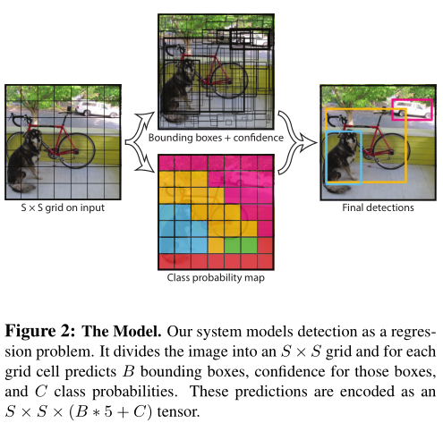

## 网络结构

网络结构如下，并没有太多特殊的地方，唯一需要关注的是使用1*1的卷积核进行多通道信息融合，提升了检测质量。该网络根据任务特点，速度与精度的要求可替换为其他网络，如ResNeXT或者作者提出的darknet。

## 核心思想

1. 统一图像大小为448 * 448
2. 输出为 $S * S * (B * 5 + C)$
   1. 将图像分为 $S * S$ 个grid 
   2. 每个grid负责预测C个类别的confidence $Pr(Class_i|Object)$，该grid所对应的唯一物体的confidence为1，其余为0
   3. 每个grid负责预测B个bounding box和对应的confidence  $Pr(Object) * IOU_{pred}^{truth}$，其中$Pr(Object)$表示是否有物体存在，$IOU_{pred}^{truth}$ 为bounding box与ground truth相交面积的百分比
      1. 注意所有bounding box负责预测同一个物体，因此（ $S * S$ 也是该网络能最大预测不同物体的数量）
      2. B个bounding box，每个bounding box包含归一化的信息（归一化坐标及offset有利于神经网络的梯度下降，梯度较稳定且不偏向任意维度）
         1. x, y: 实际bounding box中心点相对于当前中心点的offset
         2. w, h: bounding box长宽相对于实际图像大小的百分比
         3. confidence：$Pr(Object) * IOU_{pred}^{truth}$，其中$Pr(Object)$表示是否有物体存在，$IOU_{pred}^{truth}$ 为bounding box与ground truth相交面积的百分比
3. 最终的预测confidence score为$$Pr(Class_i|Object)*Pr(Object) * IOU_{pred}^{truth}=Pr(Class_i)*IOU_{pred}^{truth}, i\in(0, C)$$
4. 根据预测score去掉低于threshold(0.5或根据任务特点)之后经过non-maximum suppression后的最终的bounding box
   1. non-maximum suppression可以在预测大物体/临近物体时去掉一些重复的bounding box，能带来2%~3%的mAP提升

## Loss 函数

### 函数

$$Loss = λcoord * 坐标预测误差 + \\（对应物体的box \: confidence预测误差  + λnoobj * 不含物体的box \: confidence预测误差）\\ + 物体分类误差$$

### 解析

1. 小bounding box的预测偏差更无法接受，因此w和h被取了平凡跟进行loss计算，使同样的误差在小bounding box上更显著
2. 只计算confidence最高的bounding box与ground truth的误差，是得同一个grid的不同bounding box逐渐在尺寸/长宽/预测类别上差异化，从而使得recall得到了显著提升
3. 各种$\lambda$参数被引入解决loss的不平衡问题
   1. 包含物体的confidence只有一个，不包含的有多个，不平衡，需要更重视包含物体的confidence的误差
   2. Confidence $Pr(Object)$ 与四个坐标的误差不平衡
   3. 分类误差只有一项

